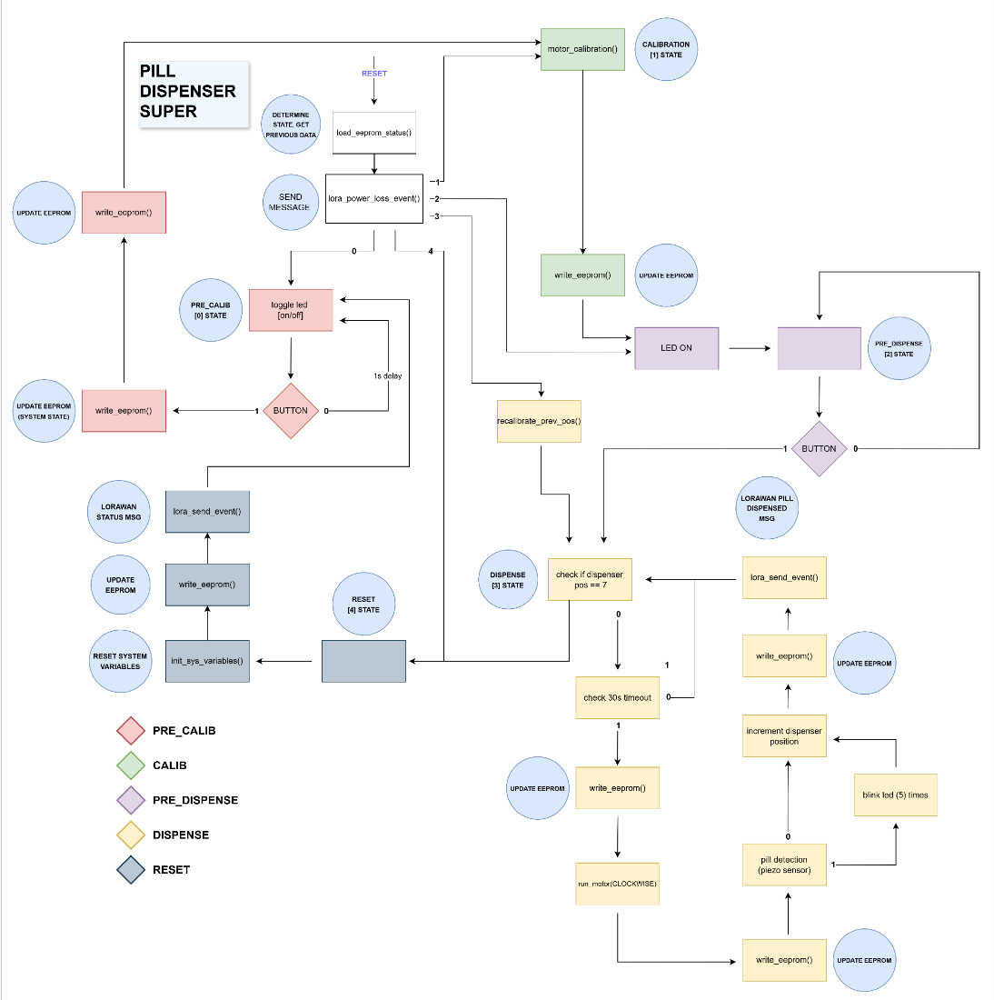

  

# Pill Dispenser Super

Pill Dispenser Super is a smart healthcare IoT device designed primarily for elderly care homes, where medication usage is high and human error poses a significant risk. The device automates medication dispensing, tracks system states, and transmits status messages and alerts wirelessly over a LoRaWAN network to an administrative server.

By ensuring the device position and operation parameters are monitored at all times, the system eliminates the need for the patient or caretaker to track dosing schedules manually—requiring only periodic refilling.

---

## Key Features

* **Automated Dispensing:** Uses motor control and calibration routines to ensure precise position tracking and medication delivery.
* **Non-Volatile State Persistence:** System state and total dispensed pill counts are continuously written to EEPROM, allowing the device to recover seamlessly after a power interruption or restart.
* **LoRaWAN Telemetry:** Transmits status updates, fault alerts, and low-inventory notifications to a designated server over a long-range LoRaWAN network.
* **Error Minimization:** Reduces reliance on human memory, mitigating risks associated with manual pill management.
* **Scalability:** Flexible modular design adaptable for personal home use, care facilities, or industrial dosing systems.

---

## Technical Stack

<table>
  <tr>
    <td valign="top">
      <h3>Software and Protocols</h3>
      <ul>
        <li><b>Programming Language:</b> Embedded C</li>
        <li><b>Connectivity Protocol:</b> LoRaWAN</li>
        <li><b>Hardware Interfaces:</b> I2C, GPIO, Hardware Interrupts, Task Queues</li>
        <li><b>Data Storage:</b> EEPROM read/write routines</li>
      </ul>
      <h3>Hardware Components</h3>
      <ul>
        <li>Embedded microcontroller unit (MCU)</li>
        <li>Motor assembly and calibration logic</li>
        <li>LoRaWAN communication module</li>
        <li>External EEPROM memory chip</li>
      </ul>
    </td>
    <td align="center" valign="top" width="280px">
      
        
      
    </td>
  </tr>
</table>

---

## System Architecture

The firmware is structured modularly across dedicated source files to ensure readability and maintainability.

1. **Initialization:** Configures standard I/O, GPIO pins, I2C bus, system variables, LoRaWAN module, and interrupt queues.
2. **State Restoration:** Reads saved operational parameters from EEPROM. If the EEPROM data is empty or unitialized, default parameters are loaded.
3. **Execution Loop:** Runs the main state machine. Critical state changes trigger an immediate update to EEPROM and dispatch corresponding LoRaWAN messages.

 

 

---

By: Sami, Max, Eeli - Metropolia UAS
